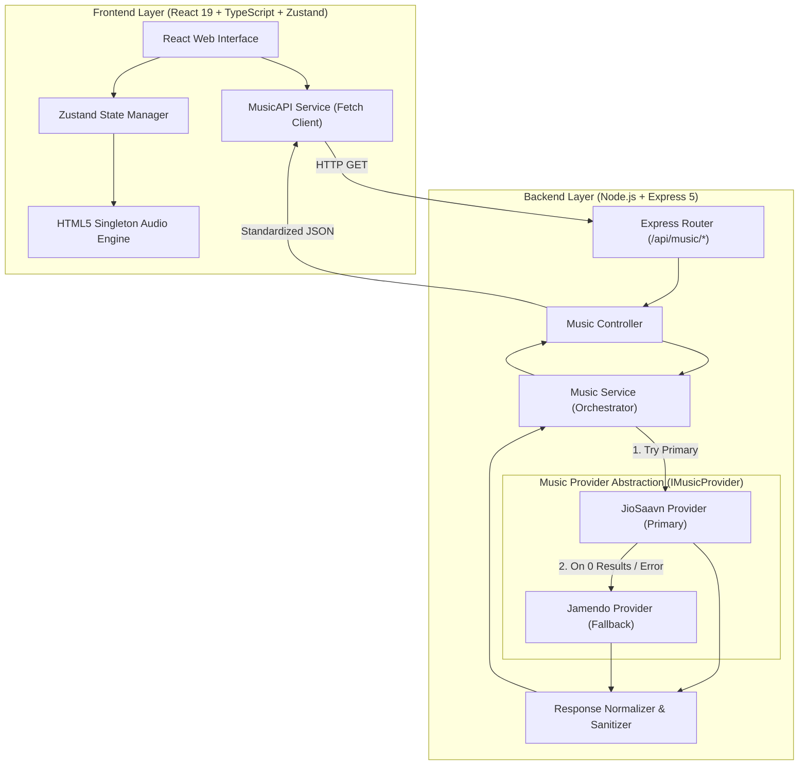

# Notify Music Player

> A production-grade, full-stack music streaming web application built with **React**, **TypeScript**, **Zustand**, and **Express.js**. Featuring multi-provider streaming, automatic provider failover, response normalization, and responsive glassmorphism UI.

[](https://www.typescriptlang.org/)
[](https://react.dev/)
[](https://expressjs.com/)
[](https://nodejs.org/)
[](https://vitejs.dev/)
[](LICENSE)

[Live Demo (Vercel)](https://notify-music-player.vercel.app/) • [Backend Health Check](https://notify-music-player.onrender.com/health) • [GitHub Repository](https://github.com/Nishantnsut27/Notify-Music-Player)

---

## Table of Contents

- [Project Overview](#project-overview)
- [Key Features](#key-features)
- [System Architecture](#system-architecture)
- [Tech Stack](#tech-stack)
- [API Overview](#api-overview)
- [Installation & Setup](#installation--setup)
- [Contributing](#contributing)
- [License](#license)

---

## Project Overview

**Notify Music Player** is a modern, responsive web application engineered to deliver uninterrupted, high-quality audio streaming. It addresses the common issue of single API dependencies in frontend audio apps by implementing a decoupled Express backend layer with **automatic multi-provider fallback orchestration**.

When users query tracks or request playback, the backend queries **JioSaavn** as its primary provider for rich metadata and high-bitrate (`320kbps`) streams. If JioSaavn yields no results or encounters upstream network issues, the backend failover system seamlessly switches to **Jamendo** as a secondary provider—ensuring 100% search and playback uptime without the client ever detecting a fallback event.

---

## Key Features

- **Multi-Provider Failover**: Automatic primary-to-secondary API fallback (JioSaavn primary → Jamendo secondary).
- **Standardized Data Contracts**: Clean normalizer layer strips vendor-specific fields and sanitizes HTML entities (`&quot;`, `&amp;`).
- **Debounced Search**: 500ms input debouncing to eliminate query thrashing and unnecessary network load.
- **Global Audio Singleton**: HTML5 audio streaming with volume controls, track seeking, next/previous tracks, and time updates.
- **Local Playlist Management**: Create custom playlists, import/export playlist configuration files in JSON format.
- **Favorites Collection**: Persistent local storage bookmarking for favorited tracks.
- **Responsive Dark Theme UI**: Custom CSS layout using glassmorphic panels, responsive drawers, and zero horizontal scrolling.
- **TypeScript End-to-End**: Strict typing across both React frontend components and Express backend models.

---

## System Architecture



### Architecture Layer Responsibilities

1. **Frontend Client**: Manages UI state, renders track lists, handles audio playback controls, and handles local state persistence.
2. **Express Router & Controller**: Validates incoming request parameters and routes endpoints to the underlying services.
3. **Music Service (Orchestrator)**: Encapsulates provider selection and handles failover logic transparently.
4. **Provider Layer**: Implements `IMusicProvider` interface to standardise Axios HTTP calls to external third-party APIs.
5. **Response Normalizer**: Sanitizes raw payloads into standard `Song`, `Album`, `Artist`, and `Playlist` domain interfaces.

---

## Tech Stack

| Domain | Technology | Description |
| :--- | :--- | :--- |
| **Frontend Framework** | React 19 | UI component architecture |
| **Frontend Build Tool**| Vite 7 | High-performance frontend bundler & dev server |
| **Language** | TypeScript 5.9 | Static typing across backend & frontend |
| **State Management** | Zustand 5 | Micro-state management for playback & store persistence |
| **Backend Framework** | Express.js 5 | Lightweight REST API web server |
| **Backend Runtime** | Node.js | Asynchronous JavaScript runtime environment |
| **HTTP Client** | Axios | Backend external API requests |
| **Primary Music Provider**| JioSaavn API | High-bitrate audio & rich regional track metadata |
| **Secondary Provider**| Jamendo API | Fallback open-license music provider |
| **Styling Layer** | Vanilla CSS | Custom CSS variables, glassmorphic UI, flexbox/grid |

---

## API Overview

### Endpoints (`/api/music/*`)

| Method | Route | Description |
| :--- | :--- | :--- |
| `GET` | `/health` | Server health check endpoint |
| `GET` | `/api/music/trending` | Fetches default trending tracks |
| `GET` | `/api/music/search?q={query}` | Searches tracks across primary & fallback providers |
| `GET` | `/api/music/song/:id` | Fetches details for a single track by ID |
| `GET` | `/api/music/album/:id` | Fetches album details and track list |
| `GET` | `/api/music/artist/:id` | Fetches artist profile and top tracks |
| `GET` | `/api/music/playlist/:id` | Fetches playlist metadata and track list |
| `GET` | `/api/music/suggestions/:id` | Fetches recommended tracks based on song ID |

---

## Installation & Setup

### Prerequisites

- **Node.js**: v18.0.0 or higher
- **npm**: v9.0.0 or higher

### Step-by-Step Installation

1. **Clone the repository**:
   ```bash
   git clone https://github.com/Nishantnsut27/Notify-Music-Player.git
   cd Notify-Music-Player
   ```

2. **Install Root & Frontend Dependencies**:
   ```bash
   npm install
   ```

3. **Install Backend Dependencies**:
   ```bash
   cd backend
   npm install
   cd ..
   ```

4. **Run Development Mode**:
   - Launch backend server:
     ```bash
     npm run backend
     ```
   - Launch Vite frontend server:
     ```bash
     npm run dev
     ```
   - Access web player at `http://localhost:5173`.

---

## Contributing

Contributions are welcome! Please follow these guidelines:

1. Fork the repository.
2. Create your feature branch (`git checkout -b feature/AmazingFeature`).
3. Commit your changes (`git commit -m 'Add some AmazingFeature'`).
4. Push to the branch (`git push origin feature/AmazingFeature`).
5. Open a Pull Request.

---

## License

Distributed under the MIT License. See `LICENSE` for details.
