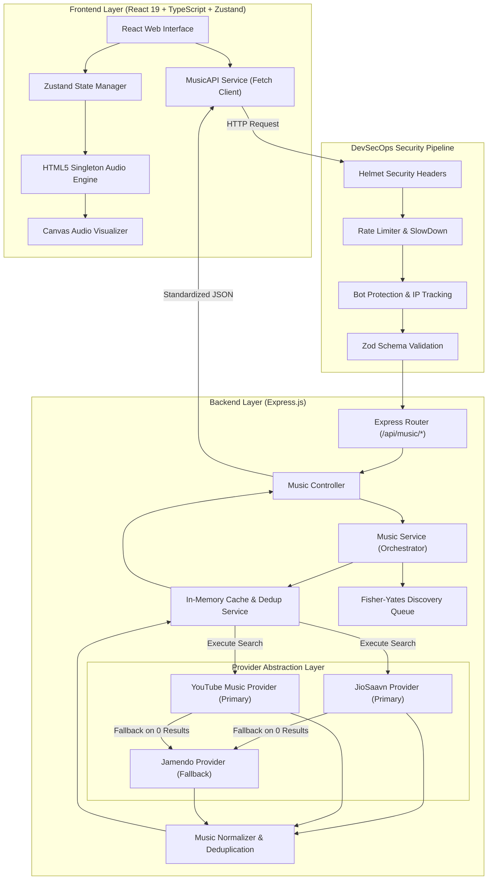

# Notify Music Player

> A production-grade, full-stack music streaming web application built with **React 19**, **TypeScript**, **Zustand**, **Express.js**, and **HTML5 Canvas**. Featuring multi-provider parallel streaming, automatic provider failover, response deduplication & ranking, Fisher-Yates discovery keyword queue, and DevSecOps security hardening.

[](https://www.typescriptlang.org/)
[](https://react.dev/)
[](https://expressjs.com/)
[](https://nodejs.org/)
[](https://vitejs.dev/)
[](LICENSE)

[Live Demo](http://localhost:5173/) • [Backend Health Check](http://localhost:5000/health) • [GitHub Repository](https://github.com/Nishantnsut27/Notify-Music-Player)

---

## Table of Contents

- [Project Overview](#project-overview)
- [Key Features](#key-features)
- [Multi-Provider & Discovery Engine](#multi-provider--discovery-engine)
- [Security & Protection Architecture](#security--protection-architecture)
- [System Architecture](#system-architecture)
- [Tech Stack](#tech-stack)
- [API Reference](#api-reference)
- [Installation & Local Setup](#installation--local-setup)
- [License](#license)

---

## Project Overview

**Notify Music Player** is a modern full-stack music streaming platform engineered for reliability, rich sound, and high performance. It solves single API dependencies common in audio applications by leveraging a decoupled Express backend with a **parallel multi-provider search engine** and **automatic failover orchestration**.

When users search or stream music, the backend queries **JioSaavn** and **YouTube Music** concurrently using `Promise.allSettled`. Results are normalized, deduplicated by audio URL and track signatures, ranked for relevance, and served to the client. If primary providers yield zero results or encounter network timeouts, the system seamlessly falls back to **Jamendo**—ensuring 100% playback and search availability.

---

## Key Features

### Frontend Capabilities
- **Canvas Audio Visualizer (`AudioVisualizer.tsx`)**: Real-time HTML5 Canvas visualizer rendering smooth harmonic frequency waves during playback. Lerps gracefully to idle state when paused and stops animation loops to consume **0 CPU/GPU resources**.
- **Spotify-Style Play Controls**: Clean, solid green action buttons with micro-animations, eliminating heavy box-shadow halos and gradient artifacts.
- **Track List Row Toggle**: Clicking any track row toggles play/pause directly without restarting the track.
- **Global Audio Singleton**: HTML5 Audio engine supporting continuous playback, progress seeking, volume adjustment with hover retention, mute toggles, and next/previous queueing.
- **Playlist Management**: Create custom playlists, edit playlist names, export playlist files, and manage track collections with context dropdown menus (`PlaylistMenu.tsx`).
- **Favorites Collection**: Persistent bookmarking for favorited tracks backed by Zustand local storage persistence.
- **Responsive Dark Mode UI**: Desktop layout with locked sidebar and mobile view with drawer navigation.

### Backend & DevSecOps Capabilities
- **Discovery Keyword System**: Configurable list of 50+ curated terms managed via a **Fisher-Yates shuffle queue (`DiscoveryService`)** to generate fresh Home content without back-to-back repeats.
- **Rate Limiting & Progressive Slowdown**: Endpoint-specific rate limiting (`express-rate-limit`) paired with progressive request delays (`express-slow-down`).
- **Bot Protection & IP Violation Tracking**: Validates `User-Agent` headers and tracks abusive IP metrics to restrict bad actors.
- **Strict Parameter Validation**: Zod schema validation for all search queries and resource IDs.
- **In-Memory Cache & Request Deduplication**: TTL response caching and in-flight request coalescing (`CacheService`) to prevent duplicate simultaneous provider queries.
- **Security Headers & CORS**: Modern HTTP headers via `helmet` and origin restrictions via `cors`.

---

## Multi-Provider & Discovery Engine

### Provider Pipeline & Fallback
The backend orchestrates queries across three distinct music providers:
1. **JioSaavn Provider**: Primary source for high-bitrate (`320kbps`) Hindi, Punjabi, and regional Indian tracks.
2. **YouTube Music Provider**: Primary source for international hits, trending singles, and live audio streams via `youtubei.js`.
3. **Jamendo Provider**: Open-license fallback provider triggered if primary APIs fail or return 0 results.

```
Search Query
   │
   ├──> JioSaavn Provider (Parallel)  ──┐
   │                                   ├──> Merged Results ──> Deduplicate ──> Rank ──> Output
   └──> YouTube Provider (Parallel)   ──┘
                                           (If 0 Results)
                                                │
                                                └──> Jamendo Fallback
```

### Discovery Keyword Queue
Instead of searching static keywords, the Home endpoint (`GET /api/music/trending`) consumes terms from a shuffled queue:
- **60% Indian Music**: Arijit Singh, Pritam, A.R. Rahman, Diljit Dosanjh, Animal, Jawan, Kabir Singh, Aashiqui 2, Shershaah.
- **25% Playlists & Charts**: Top Hindi Songs, Latest Punjabi Songs, Bollywood Hits, Desi Hip Hop, Indie India, Lo-Fi Hindi.
- **15% International Hits**: The Weeknd, Taylor Swift, Coldplay, Imagine Dragons, Ed Sheeran, Drake, Dua Lipa.

---

## Security & Protection Architecture

| Protection Layer | Implementation | Purpose |
| :--- | :--- | :--- |
| **Search Rate Limiting** | `express-rate-limit` | Caps search requests at 30 req/min per IP |
| **Progressive Slowdown** | `express-slow-down` | Adds +500ms delay per request after 15 searches |
| **Metadata Rate Limiting** | `express-rate-limit` | Caps metadata endpoints at 100 req/min per IP |
| **Input Validation** | `zod` | Validates search queries (1–100 chars) and resource IDs |
| **Bot Protection** | Custom Middleware | Rejects requests missing valid `User-Agent` headers |
| **IP Reputation** | In-Memory Violation Map | Temporarily restricts IPs triggering excessive 429 errors |
| **Request Coalescing** | `CacheService` | Coalesces identical concurrent searches into 1 provider call |
| **HTTP Security Headers**| `helmet` | Enforces Content Security Policy, Frameguard, and X-Content-Type-Options |
| **CORS Policy** | `cors` | Restricts access to configured origins (`ALLOWED_ORIGINS`) |
| **Body Size Limit** | `express.json({ limit: '10kb' })` | Prevents large payload DoS attacks |

---

## System Architecture



---

## Tech Stack

| Domain | Technology | Description |
| :--- | :--- | :--- |
| **Frontend Framework** | React 19 | Component UI architecture |
| **Build Tool** | Vite 7 | High-performance frontend bundler & dev server |
| **Language** | TypeScript 5.9 | End-to-end static typing |
| **State Management** | Zustand 5 | Playback state, queue, and local persistence |
| **Visualizer Engine** | HTML5 Canvas API | 60 FPS smooth lerp audio wave rendering |
| **Backend Framework** | Express.js 4/5 | REST API web server |
| **Backend Runtime** | Node.js | Asynchronous JavaScript runtime environment |
| **YouTube Provider** | `youtubei.js` | InnerTube API client for YouTube Music data |
| **HTTP Client** | Axios | External API request management with timeouts |
| **Security Suite** | Helmet, Express Rate Limit, Express Slow Down | Rate limiting, progressive delays, security headers |
| **Validation** | Zod | Request query and route parameter validation |
| **Response Compression**| Compression | Gzip/Deflate HTTP response compression |
| **Styling** | Vanilla CSS | CSS variables, flexbox, grid, glassmorphic layout |

---

## API Reference

All backend API endpoints are exposed under `/api/music/*`:

| Method | Route | Parameters | Description | Rate Limit |
| :--- | :--- | :--- | :--- | :--- |
| `GET` | `/health` | None | Server health status check | 60 req/min |
| `GET` | `/api/music/trending` | `limit` (default: 25) | Discovery content via Fisher-Yates keyword queue | 100 req/min |
| `GET` | `/api/music/search` | `q` (string, 1-100 chars), `limit` (1-50) | Multi-provider search (JioSaavn + YouTube) | 30 req/min + Slowdown |
| `GET` | `/api/music/song/:id` | `id` (alphanumeric string) | Single track details by ID | 100 req/min |
| `GET` | `/api/music/album/:id` | `id` (alphanumeric string) | Album metadata & track list | 100 req/min |
| `GET` | `/api/music/artist/:id` | `id` (alphanumeric string) | Artist profile & top tracks | 100 req/min |
| `GET` | `/api/music/playlist/:id` | `id` (alphanumeric string) | Playlist metadata & tracks | 100 req/min |
| `GET` | `/api/music/suggestions/:id` | `id` (alphanumeric string), `limit` | Recommended tracks for song ID | 100 req/min |

---

## Installation & Local Setup

### Prerequisites
- **Node.js**: v18.0.0 or higher
- **npm**: v9.0.0 or higher

### Step-by-Step Guide

1. **Clone Repository**:
   ```bash
   git clone https://github.com/Nishantnsut27/Notify-Music-Player.git
   cd Notify-Music-Player
   ```

2. **Install Root & Frontend Dependencies**:
   ```bash
   npm install
   ```

3. **Install Backend Dependencies**:
   ```bash
   cd backend
   npm install
   cd ..
   ```

4. **Launch Backend Server**:
   ```bash
   npm run backend
   ```
   *Backend runs at `http://localhost:5000`.*

5. **Launch Frontend Development Server**:
   ```bash
   npm run dev
   ```
   *Frontend app runs at `http://localhost:5173`.*

---

## License

Distributed under the MIT License. See `LICENSE` for details.
